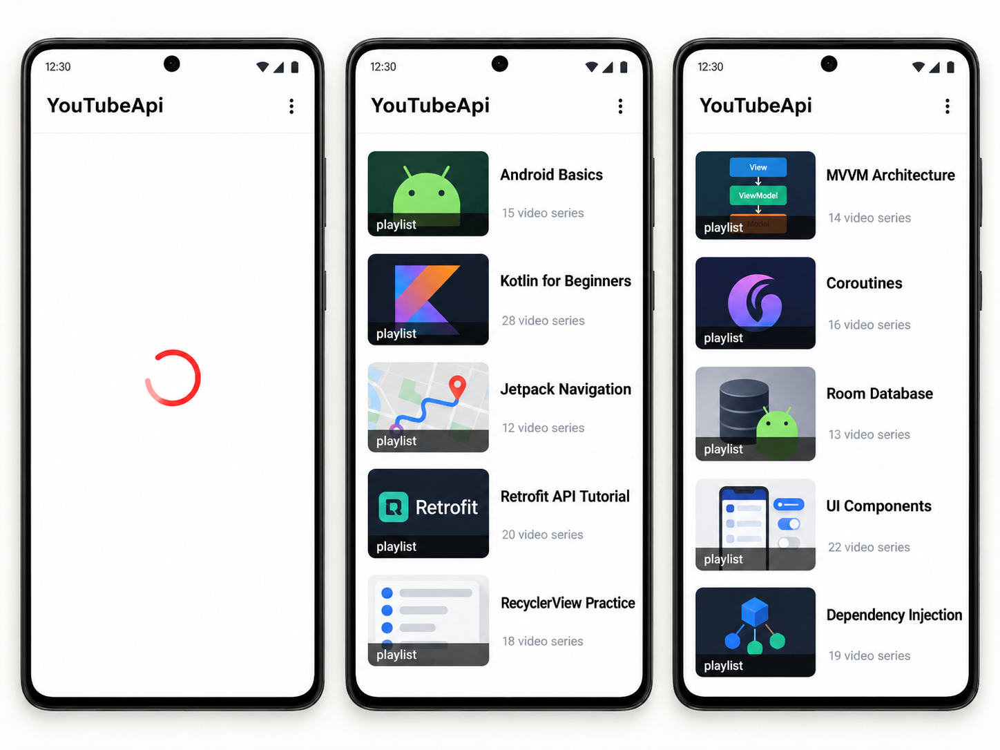

# YouTubeApi

Android-приложение для загрузки и отображения плейлистов через YouTube Data API.

Проект реализован на Kotlin и демонстрирует работу с REST API, сетевыми запросами, RecyclerView, ViewModel и dependency injection.

## Screenshots

<p align="center">
  
</p>

## Features

- загрузка плейлистов через YouTube Data API
- отображение списка плейлистов
- превью для каждого плейлиста
- отображение названия плейлиста
- отображение количества видео
- loading-состояние через Lottie
- обработка состояний Loading / Success / Error
- сетевые запросы
- работа с ViewModel
- dependency injection

## Tech Stack

- Kotlin
- Android SDK
- XML
- Retrofit
- OkHttp
- Gson
- Coroutines
- LiveData
- ViewModel
- Koin
- RecyclerView
- ViewBinding
- Navigation Component
- Safe Args
- Coil
- Lottie

## Architecture

Приложение использует отдельный ViewModel для загрузки данных.

Состояние загрузки обрабатывается через Resource:
- Loading
- Success
- Error

Koin используется для dependency injection.

Сетевые запросы выполняются через Retrofit и OkHttp.

## Main Screen

- Playlists — список YouTube-плейлистов с превью, названием и количеством видео

## Project Structure

```text
app/
├── data/
├── di/
├── ui/
│   ├── fragments/
│   ├── viewmodels/
│   └── adapters/
├── MainActivity
└── App
